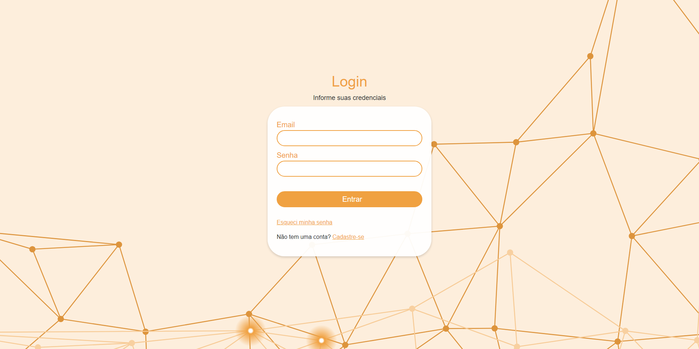

# Login - NodeJS API

# 📔 About
API developed to be used by a login application, with the possibility of adding users and password recovery.

# 💻 Is it running?
Yes! It is live and running and you can see it working behind the scenes by testing the web frontend. 😃

You can check it out up and running at [Vercel by clicking here](https://send-email-react-js.vercel.app/).

# 👀 Where can I find the web frontend?
You can check the repositories here:

[React Web Frontend Repository](https://github.com/anakarlasantana/send_email_reactJs)

# 🚀 Technologies in the API:
- Typescript
- NodeJS
- Express
- TypeORM
- PostgreSQL
- Bcrypt
- Nodemon
- Cors
- Email sending with Nodemailer
- Ethereal Email of test

# 📖 DEV Diary:
- With the depreciation of the getRepository method by TypeORM, I adapted the server to accept the new way of adapting to the database through the AppDataSource.
- Use of the Ethereal Email online tool to test sending emails in development environments.

# The author
Made with ❤️ by Ana Karla Santana. 🇧🇷

Get in touch! 😃

 

 
